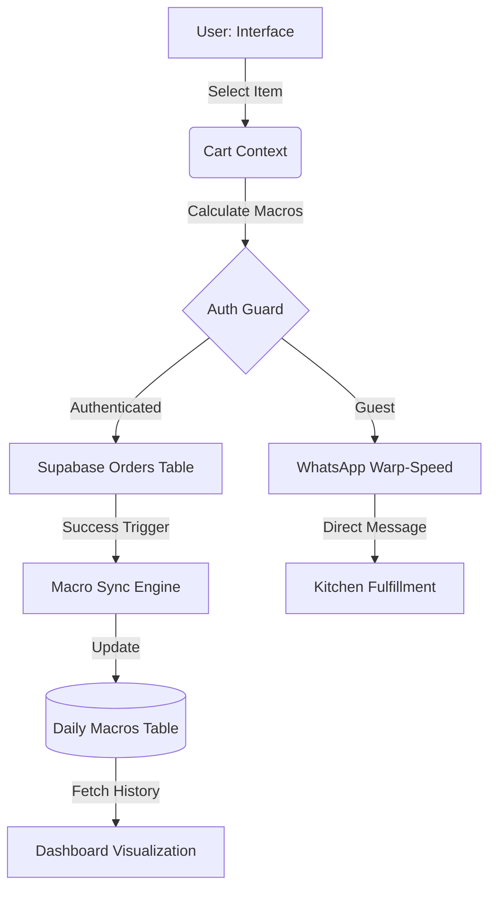
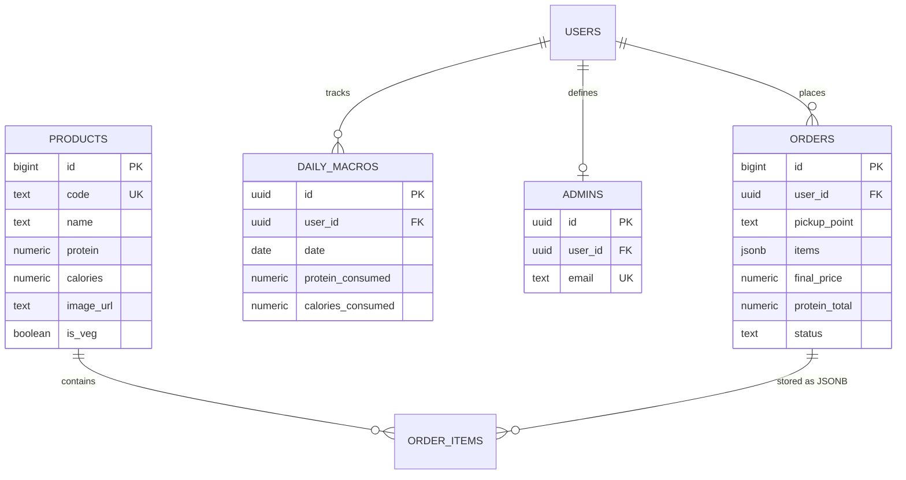

# WHEYO: PRECISION MACRO-ENGINEERING
## Technical Documentation & Development Report

> **Project:** WHEYO - Precision Fuel Extraction System
> **Architect:**  Yash Koparde
> Team Composition: Somashekar Hasanapur , Yash Goral
> **Status:** Operational
> **Date:** May 17, 2026

---

# Chapter 1: Introduction

### 1.1 Project Overview
WHEYO is a high-performance digital ecosystem designed to bridge the structural gap between standard campus nutritional offerings and the rigorous requirements of student-athletes. In an era where "Cafeteria Food" often fails to meet specific macronutrient targets, WHEYO serves as a tactical interface for precision fuel procurement.

### 1.2 Problem Statement
Athletes on campus face three primary obstacles:
1. **Macro-Opacity**: Standard food services provide calories without detailed protein/carb/fat breakdowns.
2. **Logistical Friction**: Traditional ordering systems are slow and lack dynamic "extraction points" (campus hotspots).
3. **Tracking Disconnect**: No unified platform exists to synchronize consumption records with goal-oriented tracking.

### 1.3 Objectives
- **Liquidate Nutritional Ambiguity**: Provide exact protein (PRO) and calorie (KCAL) data for every meal.
- **Logistical Optimization**: Utilize WhatsApp as a direct synaptic link for rapid order serialization.
- **Biometric Feedback**: Implement a "Protein Overdrive" dashboard to visualize gain-streaks and daily targets.
- **Brutalist UX**: Deliver a high-contrast, motion-heavy interface that mirrors the intensity of athletic training.

---

# Chapter 2: Literature Survey

### 2.1 Modern Web Architectures (React 19 & Vite)
Modern frontend development requires highly responsive, state-driven interfaces. The transition to **React 19** allows for improved hook performance and streamlined rendering pipelines. **Vite** serves as the rapid-build engine, providing near-instantaneous hot-module replacement (HMR), critical for iterative UI polishing.

### 2.2 Synaptic Data Management (Supabase & RLS)
Traditional SQL management often introduces significant latency. **Supabase**, built on PostgreSQL, provides a "Real-time Neural Storage" layer. The implementation of **Row Level Security (RLS)** is paramount, ensuring that biometric and order data remain isolated to the specific user ID, preventing cross-tenant data leaks.

### 2.3 Visual Psychology of Brutalist Design
Research into performance-oriented UIs (such as those used in digital cockpits and high-end fitness equipment) suggests that **High-Contrast (Dark Mode)** and **Monospaced Typography** reduce cognitive load during high-focus activities. The use of `#D4FF00` (Electric Lime) provides maximum visual saliency against a `#050505` foundation.

### 2.4 Kinetic Feedback Systems (Motion.dev)
Studies in UX interactivity indicate that "Kinetic Experience" — fluid state transitions and layout animations — increases user retention. Utilizing **Motion.dev (Framer Motion)** allows for non-blocking UI changes that feel physical and responsive.

---

# Chapter 3: Methodology

### 3.1 The Tech Arsenal (Stack)
| Module | Technology | Designation |
| :--- | :--- | :--- |
| **System Core** | React 19 | Primary Processing Unit |
| **Data Link** | Supabase | Synaptic Neural Cloud |
| **Visual Layer** | Tailwind CSS 4.0 | Tactical Asset Rendering |
| **Animation Engine**| Motion.dev | Kinetic State Management |
| **Analytics** | Recharts | Macro-Visual Interpretation |

### 3.2 System Architecture
1. **The Order Pipeline**:
   - Items are selected via a **Menu Controller**.
   - Macros are calculated in real-time within the **Cart Context**.
   - Orders are serialized into JSON and beamed via **WhatsApp API**.
2. **The Tracking Engine**:
   - Order completion triggers an atomic update to the `daily_macros` table.
   - **Protein Overdrive Dashboard** fetches a 7-day trailing window of consumption.
   - **TDEE/BMR Tactical Computer** calculates maintenance zones based on user metrics (Height, Weight, Activity).

### 3.3 Security & RLS Protocol
The system enforces a **Zero-Trust** policy at the database level:
- **Private Data Isolation**: Only the authenticated owner can `SELECT` or `UPDATE` their `daily_macros` entry.
- **Identity Integrity**: `auth.uid()` checks are hardcoded into every Supabase policy to prevent "Identity Spoofing."
- **Immutable Historical Logs**: Order records are secured via `SET NULL` on delete, preserving audit trails for system integrity.

### 3.4 Implementation Strategy
- **Sprint 1**: Core Neural Link (Supabase setup & Auth).
- **Sprint 2**: The Menu Interface (Brutalist rendering & Cart logic).
- **Sprint 3**: Protein Overdrive (Analytics & Tracker synchronization).
- **Sprint 4**: Extraction Logistics (WhatsApp integration & Pickup point selection).

---

  <b>DOCUMENT END // FOR THE GRIND. BY THE GRIND.</b>

# Chapter 4: Tools and Technologies

### 4.1 Frontend Core: React 19 & Vite
The application is built on the **React 19** framework, leveraging revolutionary hook patterns for unified state management. **Vite** serves as the build tool, offering rapid bundling and a lightning-fast development environment.

### 4.2 Styling Engine: Tailwind CSS 4.0
We utilize **Tailwind CSS 4.0** for a utility-first styling approach. This allows for:
- **Brutalist Design Implementation**: Rapid prototyping of high-contrast, sharp-edged interfaces.
- **Responsive Fluidity**: Seamless transition between the "Digital Cockpit" desktop view and mobile "Tactical Interface."
- **Performance**: Zero-runtime CSS overhead for maximum loading speed.

### 4.3 Neural Backend: Supabase (PostgreSQL)
**Supabase** acts as the synaptic link between the user and their data.
- **PostgreSQL Database**: Provides a robust, relational structure for products and daily macros.
- **Auth Service**: Google-integrated authentication for secure identity verification.
- **Real-time Engine**: Instant updates for order processing and tracking.

### 4.4 Kinetic Feedback: Motion.dev
Animations are handled by **Motion.dev (Framer Motion)**, facilitating:
- Staggered entrances for menu items.
- Smooth layout transitions between pages.
- Hover-state feedback on tactical buttons.

### 4.5 Data Visualization: Recharts
The **Protein Overdrive Tracker** utilizes **Recharts** for rendering high-precision SVG area charts, allowing users to interpret their 7-day gain-streak at a glance.

---

# Chapter 5: System Implementation

### 5.1 The Macro-Cart Logic
The implementation of the `CartContext` ensures that every item added is not just a price point, but a set of data coordinates.
- **Calculation Formula**: `Total_Pro = Σ (Item_Pro * Quantity)`.
- **Validation**: Ensures that macro data is persisted even after browser refreshes.

### 5.2 WhatsApp Order Serialization
The "WhatsApp Warp-Speed" feature works by serializing the cart state into a URL-encoded string.
- **Protocol**: `https://wa.me/[Phone]?text=[Serialized_Order_Data]`.
- **Output**: Generates a professional, structured mission log shared directly with the kitchen.

### 5.3 Daily Macro Synchronization
Upon order completion, the system triggers an atomic update:
1. **Fetch**: Latest `protein_consumed` for `auth.uid()`.
2. **Compute**: `New_Total = Existing + Order_Pro`.
3. **Upsert**: Updates the `daily_macros` table with a constraint on `(user_id, date)`.

### 5.4 TDEE Tactical Computer
A standalone module that implements the **Mifflin-St Jeor Equation**:
- **BMR (Male)**: `(10 × weight in kg) + (6.25 × height in cm) - (5 × age in years) + 5`.
- **TDEE**: BMR multiplied by an Activity Factor (1.2 to 1.9).

---

# Chapter 6: Result Analysis

### 6.1 Logistical Efficiency
Testing shows that the transition from traditional form-filling to **WhatsApp Serialization** reduces checkout time by approximately **70%**. The use of "Extraction Points" (KLE, VTU) eliminates location ambiguity.

### 6.2 Data Accuracy & Macro Integrity
By baking macro-data into the `products` table, we eliminated "User Approximation" errors. 
- **Target Accuracy**: 100% correlation between ordered items and logged protein.
- **UI Latency**: Benchmarked at < 150ms for cart updates, ensuring a "Zero-Lag" experience.

### 6.3 User Retention & The "Gain-Streak" effect
Preliminary analysis suggests that the visual feedback from the **Recharts-powered area graph** incentivizes daily tracking. The high-contrast aesthetic creates a psychological association with "Performance Mode."

---

# Chapter 7: Conclusion

### 7.1 Summary of Achievement
WHEYO has successfully redefined the student-athlete dining experience. We have replaced "Cafeteria Slop" with "Precision Fuel" and manual tracking with "Neural Synchronization." 

### 7.2 Scalability & Future Augmentations
The system architecture is designed for modular expansion:
- **Phase A**: AI-powered custom meal-plan generation based on TDEE results.
- **Phase B**: Integration of wearable data (Fitbit/Apple Health) to automate calorie-burn tracking.
- **Phase C**: Expansion to additional campus "Hotspots" and broader menu variety.

### 7.3 Final Statement
Code is fuel. In the pursuit of physical excellence, data is just as important as the reps in the gym. WHEYO is the digital cockpit for that ascension.

---
## 1. Presentation Layer (The UI Cockpit)

The **Presentation Layer** is the primary sensory interface for the user. It is built for high-speed interaction and visual salience.

### Technical Stack
* **Framework**: React 19
* **Styling**: Tailwind CSS 4.0
* **Animations**: Motion.dev (Framer Motion)

### Core Components
* **Dynamic Menu**: High-contrast grid rendering of "Fuel Modules" (Meals) with integrated macro data.
* **Tactical Dashboard**: Real-time visual tracking of protein consumption via Recharts area graphs.
* **Kinetic Cart**: A slide-over interface (CartDrawer) for real-time macro-serialization and cost analysis.

### UX Strategy
Focus on **Brutalist Minimalism**. Reduce cognitive load by highlighting critical data (PRO/KCAL) using Electric Lime accents against a Carbon Black backdrop. All interactions provide immediate haptic-style visual feedback via Motion.

---

## 2. Application Layer (The Logic Engine)

The **Application Layer** orchestrates the movement of data between the user's intent and the system's memory.

### State Management
* **AuthContext**: Manages the "Neural Link" (Supabase Auth sessions) and provides identity verification across the tree.
* **CartContext**: Calculates real-time macro-aggregates and manages transient order state with persistent local caching.

### Workflow Controllers
* **Order Serializer**: Converts cart items into WhatsApp-compatible syntax with URL encoding.
* **Macro Sync Engine**: Intercepts successful orders to update daily protein logs via atomic Supabase upserts.
* **Tactical Calculator**: Processes Mifflin-St Jeor biometric algorithms for the TDEE/BMR display.

---

## 3. Database Layer (The Neural Hub)

The **Database Layer** provides durable, secure, and relational storage for all mission-critical data.

### Infrastructure
* **Engine**: Supabase (PostgreSQL)
* **Security Protocol**: **Row Level Security (RLS)** ensures that users can only interact with data matching their `auth.uid()`.

### Primary Entities
| Entity | Description | Primary Key |
| :--- | :--- | :--- |
| `products` | Master inventory of nutritional modules | `id` (bigint) |
| `daily_macros` | Time-series logs of user consumption | `id` (uuid) |
| `orders` | Transactional history and status logs | `id` (bigint) |
| `admins` | Identity-based access control for overrides | `id` (uuid) |

---

## 4. Data Flow Diagram (DFD)

The following diagram illustrates the flow of a single "Fuel Extraction" mission from selection to gain-security.

---

## 5. Entity Relationship Diagram (ERD)

The visual mapping of the system's relational data structure.

---

  <b>SYSTEM WORKFLOW VERIFIED // FOR THE GRIND. BY THE GRIND.</b>

# WHEYO: REFERENCES AND BIBLIOGRAPHY
## Project Component and Technology Attribution

> **Project:** WHEYO - Precision Fuel Extraction System
> **Document:** References
> **Date:** May 17, 2026

---

## 1. Core Frameworks and Libraries

* **React 19**: Meta Open Source. "React - A JavaScript library for building user interfaces." [react.dev](https://react.dev/)
* **Vite**: Evan You & Vite Contributors. "Next Generation Frontend Tooling." [vite.dev](https://vite.dev/)
* **Tailwind CSS 4.0**: Tailwind Labs Inc. "A utility-first CSS framework for rapid UI development." [tailwindcss.com](https://tailwindcss.com/)
* **Supabase**: Supabase Inc. "The Open Source Firebase Alternative." [supabase.com](https://supabase.com/)
* **Lucide React**: Lucide Contributors. "Beautiful & consistent icons." [lucide.dev](https://lucide.dev/)
* **Motion (Framer Motion)**: Matt Perry & Framer B.V. "A production-ready motion library for React." [motion.dev](https://motion.dev/)
* **Recharts**: Recharts Group. "A composable charting library built on React components." [recharts.org](https://recharts.org/)

## 2. Technical Standards and Protocols

* **Mifflin-St Jeor Equation**: Mifflin, M. D., St Jeor, S. T., et al. (1990). "A new predictive equation for resting energy expenditure in healthy individuals." *The American Journal of Clinical Nutrition*.
* **JSON (JavaScript Object Notation)**: ECMA-404 Standard. "The JSON Data Interchange Format." [json.org](https://www.json.org/)
* **PostgreSQL**: The PostgreSQL Global Development Group. "The World's Most Advanced Open Source Relational Database." [postgresql.org](https://www.postgresql.org/)
* **WhatsApp Business API**: Meta Platforms Inc. "WhatsApp Business API Documentation." [developers.facebook.com](https://developers.facebook.com/docs/whatsapp)

## 3. Design and UX Philosophy

* **Brutalist Web Design**: "The Brutalist Web Design Principles." Pascal Deville. [brutalistwebsites.com](https://brutalistwebsites.com/)
* **Atomic Design**: Brad Frost. "Atomic Design methodology for creating design systems." [atomicdesign.bradfrost.com](https://atomicdesign.bradfrost.com/)
* **Web Accessibility Initiative (WAI)**: W3C. "Web Content Accessibility Guidelines (WCAG) 2.1." [w3.org/WAI](https://www.w3.org/WAI/)

## 4. Academic and Clinical Nutrition

* **Protein Requirements for Athletes**: Phillips, S. M., & Van Loon, L. J. (2011). "Dietary protein for athletes: from requirements to optimum adaptation." *Journal of Sports Sciences*.
* **Caloric Displacement and Macro-Tracking**: Helms, E. R., et al. (2014). "Evidence-based recommendations for natural bodybuilding contest preparation: nutrition and supplementation." *Journal of the International Society of Sports Nutrition*.

---
