# WHEYO: VISUAL ARCHITECTURE & SCHEMATIC BLUEPRINTS

> **Project:** WHEYO - Precision Fuel Ecosystem
> **Document:** Structural Diagrams (Compact A4 Specifications)
> **Systems:** Admin Mission Control & Client Tactical Interface
> **Date:** May 17, 2026

---

## Technical Note on Visualization
The following diagrams are strictly vertical (**Top-Down**) and optimized for **A4 Portrait** export. Labels are minimized to prevent horizontal overflow in PDF renders.

---

## 1. System Architecture
**Focus:** Front-to-Back Connectivity.

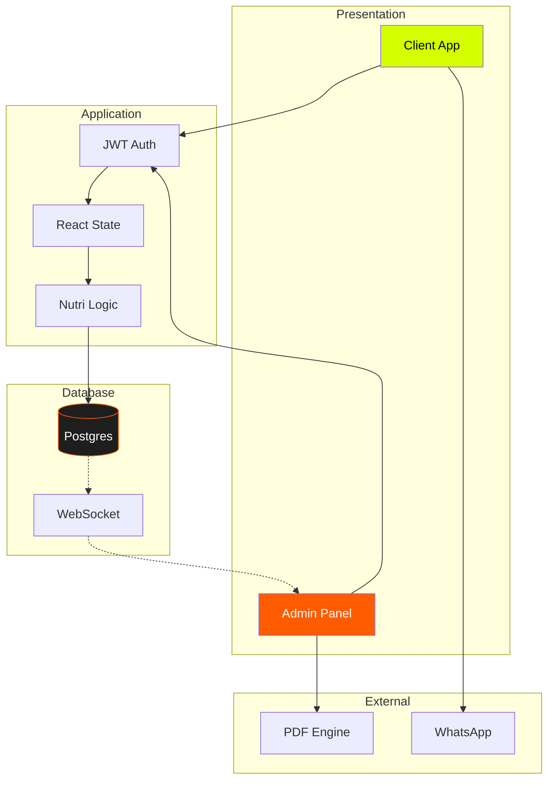

---

## 2. Compact ERD
**Focus:** Relational Schema.

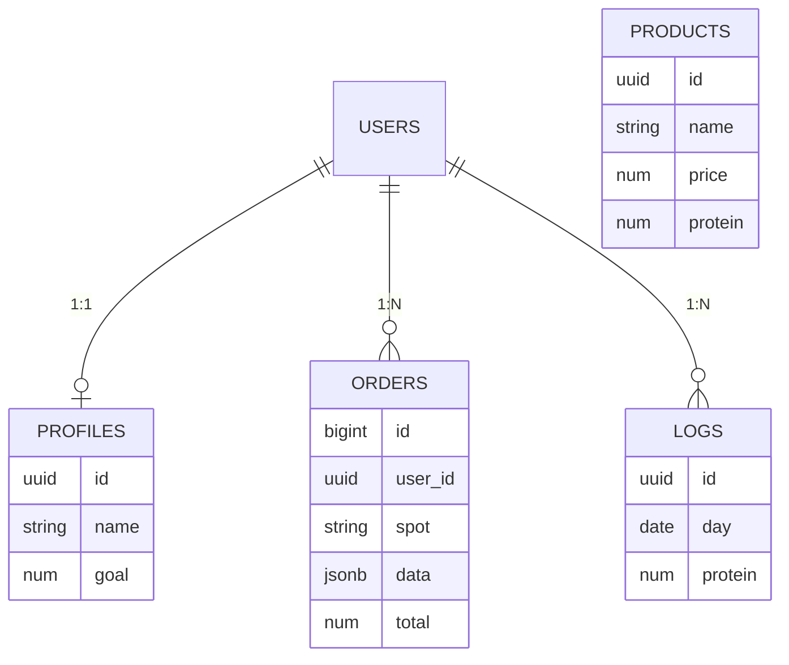

---

## 3. Macro Data Flow (L0)
**Focus:** Transactional Loop.

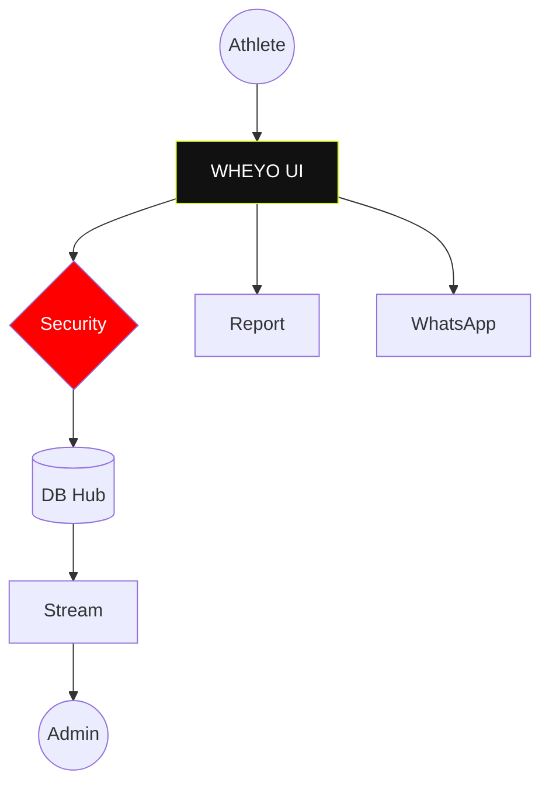

---

## 4. Auth & RLS Logic
**Focus:** Permission Engine.

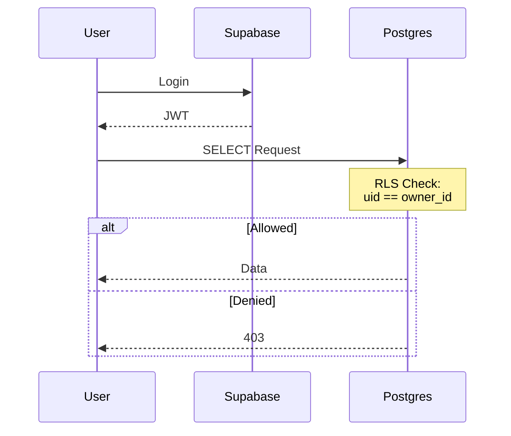

---

## 5. Admin Mission Workflow
**Focus:** Backend Operations.

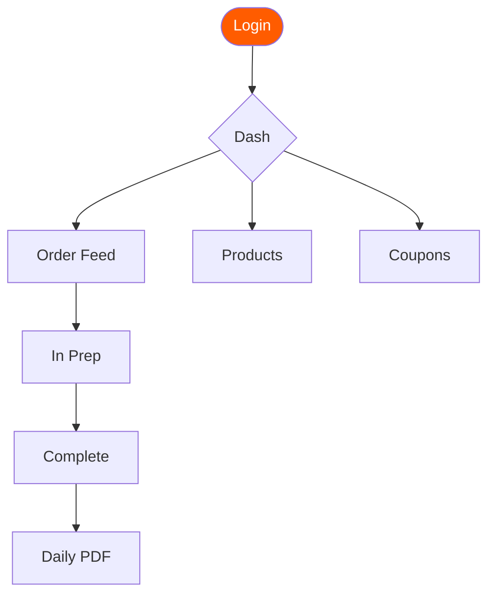

---

## 6. Client Order Lifecycle
**Focus:** State Transitions.

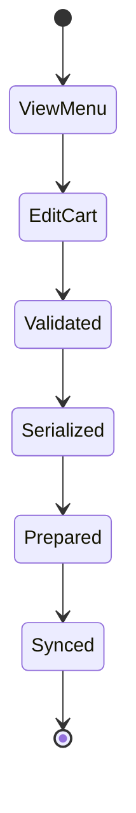

---

## 7. M.E.S.T Tech Stack
**Focus:** Core Dependencies.

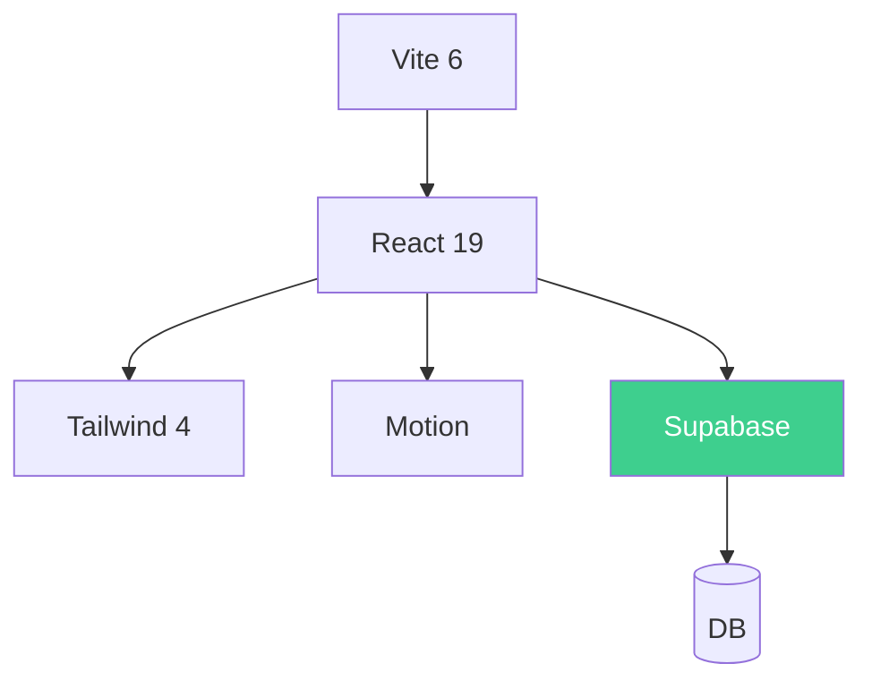

---

## 8. Gain Streak Logic
**Focus:** Incremental Sync.

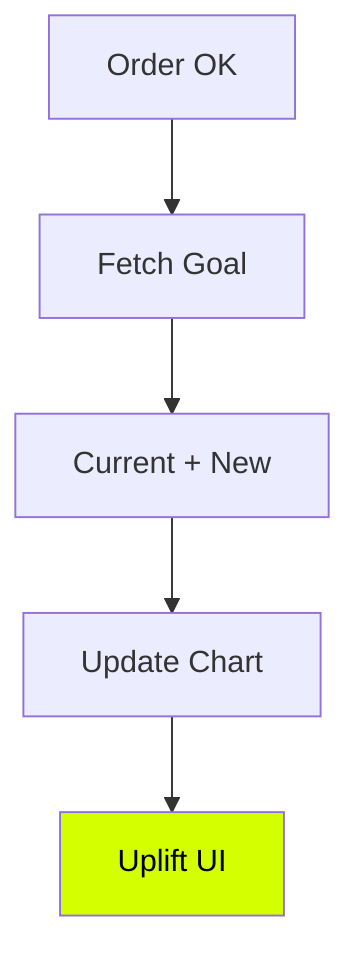

---

## 9. Roles Matrix
**Focus:** Vertical Partition.

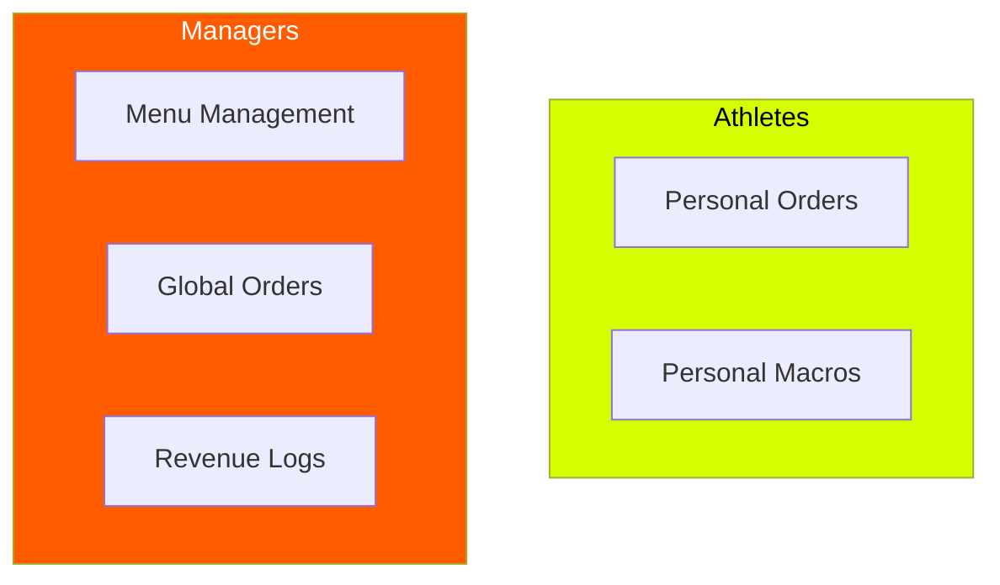

---

## 10. Warp-Speed Protocol
**Focus:** Serialization Path.

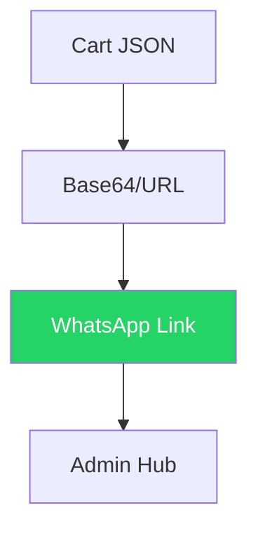

---

## 11. Database Topology
**Focus:** RLS Isolation.

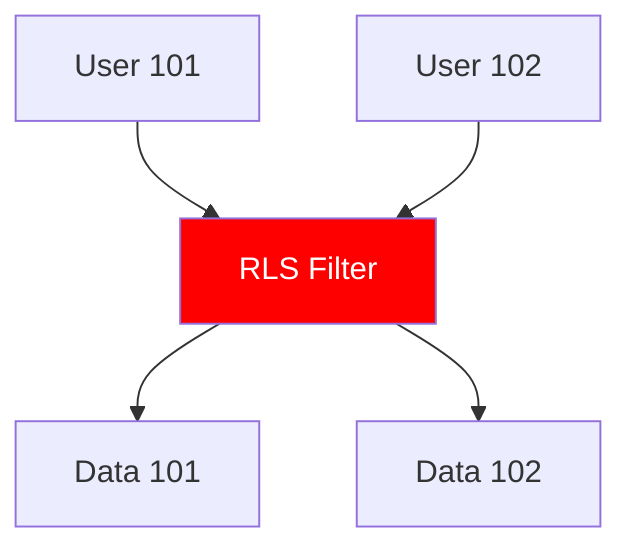

---

## 12. Scalability Map
**Focus:** Infrastructure.

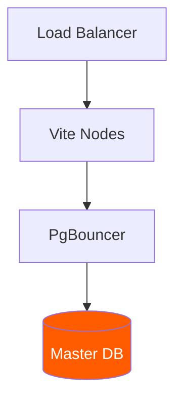

---

*Generated by WHEYO Technical Design System | A4 Compact Build | 2026*

