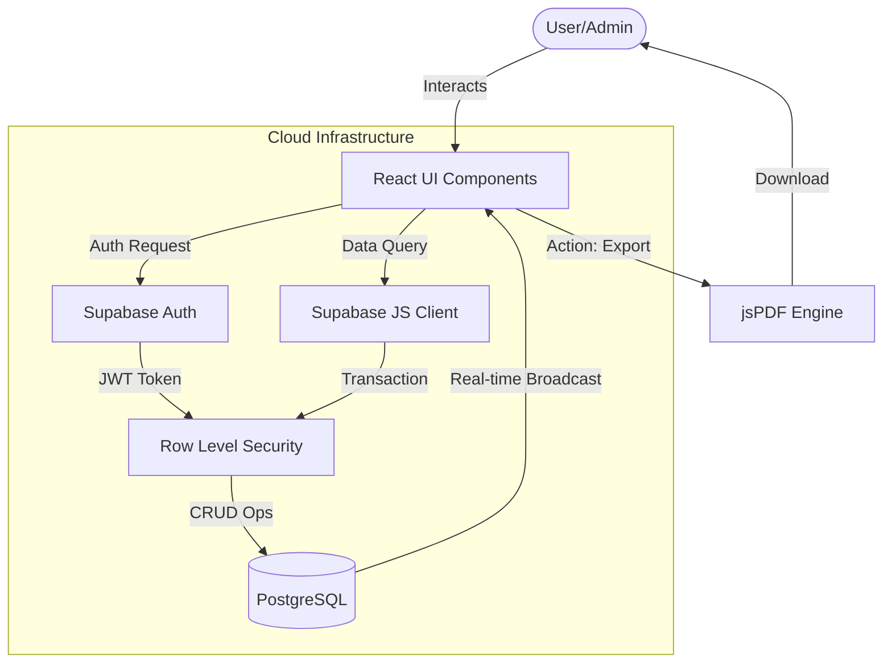
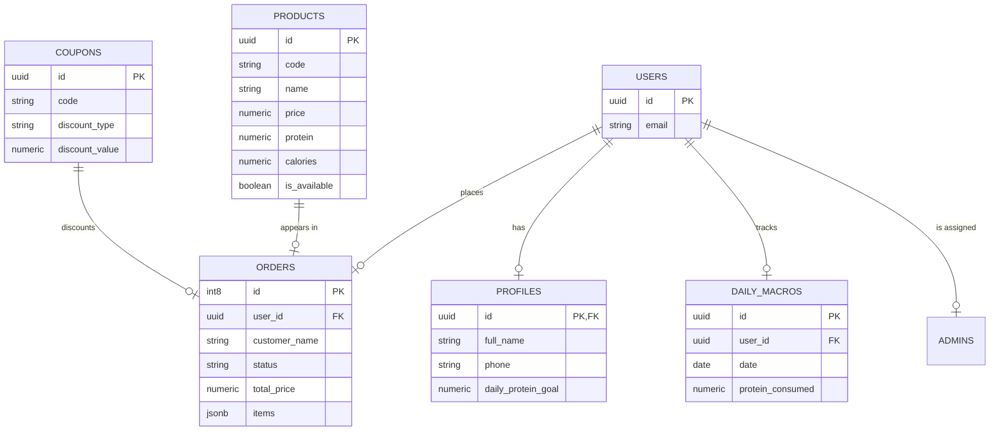

# Project Workflow & Architecture: Wheyo
> **System Architecture, Data Modeling, and Operational Flow**

---

## 1. Presentation Layer (The Frontend)

The presentation layer is designed with a **Brutalist-Modernist** aesthetic, prioritizing data density and rapid interaction.

- **UI Framework**: React 19 (Functional Components & Hooks).
- **Styling Engine**: Tailwind CSS 4 (Utility-first architecture).
- **Core Views**:
    - `Dashboard`: Real-time analytics visualization via Recharts.
    - `OrderFeed`: Real-time websocket-driven order monitoring.
    - `ProductManager`: CRUD interface for inventory control.
    - `CouponManager`: Promotional logic management.
- **Micro-Interactions**: Driven by **Motion** to provide tactile feedback and maintain spatial consistency during state changes.

---

## 2. Application Layer (The Logic)

This layer acts as the bridge between the UI and the data, managing state and external service orchestration.

- **State Management**: React `useState` and `useEffect` hooks for local state; Supabase real-time subscriptions for global/live state.
- **Authentication Services**: Supabase Auth (JWT) handling login, session persistence, and secure route guarding.
- **Client-Side Processing**:
    - `jsPDF` integration for generating PDF manifests on-demand.
    - Client-side validation logic for coupon applicability and product constraints.
- **Build & Optimization**: Vite-driven bundling with manual chunking to separate vendor libraries from application code.

---

## 3. Database Layer (The Storage)

A multi-tenant, relational architecture hosted on **Supabase (PostgreSQL)**.

- **Primary DB**: PostgreSQL.
- **Security**: **Row-Level Security (RLS)** policies enforced at the table level.
- **Schema Strategy**:
    - UUIDs for all primary identifiers to ensure globally unique records.
    - JSONB for flexible storage of order line items.
    - Foreign Key constraints to maintain relational integrity between Users, Orders, and Profiles.

---

## 4. Data Flow Diagram (DFD)

The following diagram illustrates how information moves through the system from a User's interaction to the persistent storage.

---

## 5. ER Diagram (Entity Relationship)

This diagram outlines the relational structure of the database schema, ensuring data consistency and traceability.

---

*Generated by AI Studio Build Pipeline | 2026*
